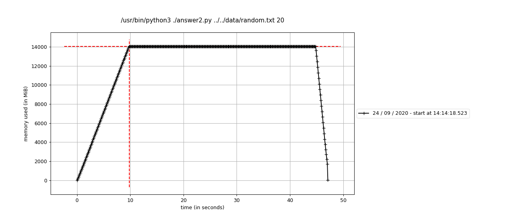

# Challenge 1 Results

## Input

File size: 1.9 GB

201,339,276 integers between 1 and 1,000,000,000 inclusive

### Test Cases

Submissions will be tested by searching the above input file for addends that
add to the following target values:

1. 480107308 (best case)
2. 193729123
3. 199029
4. 2500
5. 20
6. 25
7. 2000000000 (worst case)

## Results

| target value | gek | greenjam98 | hrshenk\* O(n) | thehinkydonut | thunderhorse\*\* O(n) | veender |
| --- | --- | --- | --- | --- | --- | --- |
| 480107308 (best case)     | 11.86s | 54.07s | 0.020s | 313.17s  | 0.019s  | 35.14s  |
| 193729123                 | 347.46s| 49.13s | 0.54s  | 353.19s  | 0.028s  | 324.82s |
| 199029                    | DNF    | 44.67s | 2.65s  | 455.81s  | 0.48s   | DNF     |
| 2500                      | DNF    | 46.47s | 17.49s  | 232.76s | 2.80s   | DNF     |
| 20                        | DNF    | 48.34s | 288.34s | 233.55s | 27.46s  | DNF     |
| 25                        | DNF    | 44.86s | 227.31s | DNF     | 27.86s  | DNF     |
| 2000000000 (worst case)   | DNF    | DNF    | 229.22s | DNF     | 199.41s | DNF     |

\* Winner!

\*\* Thunderhorse is judging this competition and therefore ineligible to
compete. His times are listed only for reference.

### Memory Utilization

#### gek

#### greenjam98

#### hrshenk

#### thehinkydonut

#### thunderhorse

#### veender

### Winners
1st Place: hrshenk (20 points)
Cleanest Code: hrshenk (10 points)

Since I'm the judge and I can do what I want, I'm awarding 5 points to
greenjam98. His runtimes are fairly consistent and his solution performs
decently well in all but the worst case.
